# JIRA API Python Package

[](https://github.com/carlosmarte/jira-api-module/actions)
[](https://badge.fury.io/py/jira-api)
[](https://www.python.org/downloads/)
[](https://opensource.org/licenses/MIT)
[](https://github.com/psf/black)

A comprehensive, production-ready Python package for interacting with **Jira Cloud REST API v3**. Built with enterprise-grade architecture and modern Python practices.

JIRA API Doc: https://developer.atlassian.com/server/jira/platform/rest/v10007/intro/#gettingstarted

## ✨ Features

- **🔌 Four Interfaces**: Direct Import, CLI, REST Server, and SDK Client
- **⚡ Modern Stack**: FastAPI, Pydantic, HTTPX, Typer, Rich
- **🔒 Type Safety**: Full mypy strict compliance with Pydantic models
- **🧪 Well Tested**: 80%+ test coverage with pytest
- **📖 Auto Documentation**: Generated OpenAPI docs and user guides
- **🚀 Production Ready**: CI/CD pipeline, error handling, security
- **🏗️ Enterprise Architecture**: Layered design with separation of concerns

## 🚀 Quick Start

### Installation

```bash
pip install jira-api
```

### Direct Python Usage

```python
from jira_api import JiraClient
from jira_api.services import IssueService

# Initialize and use the client
with JiraClient("https://company.atlassian.net", "email@company.com", "api_token") as client:
    # Get issue details
    issue = client.get_issue("PROJ-123")
    print(f"Issue: {issue.fields.summary}")

    # Create a new issue using issue type ID (traditional way)
    from jira_api.models.issue import IssueCreate

    new_issue = client.create_issue(IssueCreate(
        project_id="10000",
        summary="Critical bug in login system",
        issue_type_id="10001",
        description="Users cannot authenticate",
        labels=["bug", "urgent"]
    ))
    print(f"Created: {new_issue.key}")

    # Create an issue using issue type name (new way - recommended)
    issue_service = IssueService(client)
    issue = issue_service.create_issue_by_type_name(
        project_key="PROJ",
        summary="Authentication system failure",
        issue_type_name="Bug",  # Use readable name instead of ID
        description="Users cannot log in",
        labels=["authentication", "critical"]
    )
    print(f"Created issue: {issue.key}")

    # List available issue types for a project
    issue_types = client.get_project_issue_types("PROJ")
    for issue_type in issue_types:
        print(f"ID: {issue_type['id']}, Name: {issue_type['name']}")
```

### Command Line Interface

```bash
# Configure credentials (interactive)
jira-api configure

# List available issue types for a project
jira-api issue list-types PROJ

# Create an issue using issue type name (recommended)
jira-api issue create-by-name \
  --project PROJ \
  --summary "Fix authentication bug" \
  --type-name "Bug" \
  --description "Critical login issue" \
  --assignee "developer@company.com" \
  --labels "bug,urgent"

# Create an issue using issue type ID (traditional way)
jira-api issue create \
  --project PROJ \
  --summary "Fix authentication bug" \
  --type 10001 \
  --description "Critical login issue" \
  --assignee "developer@company.com" \
  --labels "bug,urgent"

# Get issue details
jira-api issue get PROJ-123

# List available transitions
jira-api issue transitions PROJ-123

# Transition issue
jira-api issue transition PROJ-123 "In Progress" --comment "Starting work"
```

### REST API Server

```bash
# Set environment variables
export JIRA_BASE_URL="https://company.atlassian.net"
export JIRA_EMAIL="your-email@company.com"
export JIRA_API_TOKEN="your-api-token"

# Start the server
jira-api server --host 0.0.0.0 --port 8000

# Access interactive docs at http://localhost:8000/docs
```

### SDK Client

```python
from jira_api.sdk import JiraSDKClient

# Connect to your JIRA API server
with JiraSDKClient("http://localhost:8000", api_key="your-key") as sdk:
    # Search users
    users = sdk.search_users("developer")

    # Create issue using convenience method
    bug = sdk.create_bug(
        project_id="10000",
        summary="SDK created bug",
        assignee_account_id="user-account-id"
    )

    # Get and update issue
    issue = sdk.get_issue("PROJ-123")
    sdk.update_issue("PROJ-123", {"summary": "Updated via SDK"})
```

## 🏗️ Architecture

### Four Interfaces, One Codebase

```mermaid
graph TB
    A[🐍 Direct Import] --> E[Core JIRA Client]
    B[💻 CLI Interface] --> E
    C[🌐 REST Server] --> E
    D[📦 SDK Client] --> C

    E --> F[JIRA Cloud API v3]

    subgraph "Service Layer"
        G[👥 User Service]
        H[🎫 Issue Service]
        I[📁 Project Service]
    end

    E --> G
    E --> H
    E --> I
```



### Layered Architecture

- **Interface Layer**: CLI, REST Server, SDK Client
- **Service Layer**: Business logic and high-level operations
- **Core Layer**: JIRA API communication with HTTPX
- **Model Layer**: Pydantic models for type safety

## 📋 Supported Operations

### 👥 User Management

- Get user by account ID or email
- Search users with query filters
- Find assignable users for projects
- User information and status

### 🎫 Issue Management

- **CRUD Operations**: Create, read, update issues
- **Workflow**: Get transitions, perform transitions
- **Assignment**: Assign/unassign issues to users
- **Labels**: Add/remove labels dynamically
- **Rich Content**: Support for Atlassian Document Format (ADF)

### 📁 Project Management

- Get project details and metadata
- **Version Management**: List, create, filter versions
- Get available issue types and priorities
- Project configuration access

## 🛡️ Security & Best Practices

### Authentication

- **API Token Only**: Secure token-based authentication (no passwords)
- **HTTPS Required**: All communication over encrypted connections
- **Credential Security**: Secure storage with proper file permissions

### Input Validation

- **Pydantic Models**: Strict type validation for all inputs
- **Schema Validation**: OpenAPI schema enforcement
- **Error Handling**: Comprehensive exception hierarchy

### Security Features

- No logging of sensitive information
- Optional API key protection for server endpoints
- Configurable timeouts and rate limiting
- Input sanitization and validation

## 📊 Quality & Testing

### Code Quality

- **Type Safety**: 100% mypy strict compliance
- **Linting**: Ruff for modern Python linting
- **Formatting**: Black-compatible code style
- **Documentation**: Comprehensive docstrings

### Testing Strategy

- **Unit Tests**: 80%+ coverage with pytest
- **Integration Tests**: Real API workflow testing
- **Mocking**: External dependency isolation
- **CI/CD**: Automated testing on Python 3.9-3.11

### Performance

- **Connection Pooling**: Efficient HTTP resource management
- **Async Support**: FastAPI async endpoints
- **Timeout Configuration**: Configurable request timeouts
- **Memory Efficiency**: Minimal footprint design

## 📖 Documentation

- **[User Guide](https://carlosmarte.github.io/jira-api-module/)**: Complete usage documentation
- **[API Reference](https://carlosmarte.github.io/jira-api-module/api-reference/)**: Auto-generated API docs
- **[Examples](https://carlosmarte.github.io/jira-api-module/examples/)**: Practical usage examples
- **[Architecture Guide](tech-overview.md)**: Technical implementation details

## 🛠️ Development

### Setup Development Environment

```bash
# Clone repository
git clone https://github.com/carlosmarte/jira-api-module.git
cd jira-api-module

# Install with Poetry
poetry install --with dev

# Install pre-commit hooks
poetry run pre-commit install

# Run tests
poetry run pytest

# Start development server
poetry run jira-api server --reload
```

### Project Structure

```
src/jira_api/
├── __init__.py          # Package exports
├── cli.py               # Typer CLI interface
├── server.py            # FastAPI REST server
├── config.py            # Configuration management
├── exceptions.py        # Custom exception hierarchy
├── core/
│   └── client.py        # Core JIRA API client
├── models/              # Pydantic data models
│   ├── user.py
│   ├── issue.py
│   └── project.py
├── services/            # Business logic layer
│   ├── user_service.py
│   ├── issue_service.py
│   └── project_service.py
└── sdk/
    └── client.py        # SDK for REST server
```

### Contributing

1. Fork the repository
2. Create a feature branch (`git checkout -b feature/amazing-feature`)
3. Make your changes with tests
4. Run quality checks (`poetry run pytest && poetry run mypy src/`)
5. Commit changes (`git commit -m 'Add amazing feature'`)
6. Push to branch (`git push origin feature/amazing-feature`)
7. Open a Pull Request

## 📦 Dependencies

### Core Dependencies

- **httpx**: Modern HTTP client with async support
- **pydantic**: Data validation and serialization
- **typer**: Modern CLI framework
- **rich**: Rich text and beautiful formatting
- **fastapi**: High-performance web framework
- **uvicorn**: ASGI server implementation

### Development Dependencies

- **pytest**: Testing framework with coverage
- **mypy**: Static type checking
- **ruff**: Fast Python linter and formatter
- **mkdocs**: Documentation generation
- **pre-commit**: Git hook framework

## 🔗 Links

- **[PyPI Package](https://pypi.org/project/jira-api/)**
- **[Documentation](https://carlosmarte.github.io/jira-api-module/)**
- **[Source Code](https://github.com/carlosmarte/jira-api-module)**
- **[Issue Tracker](https://github.com/carlosmarte/jira-api-module/issues)**
- **[Changelog](https://github.com/carlosmarte/jira-api-module/releases)**

## 📄 License

This project is licensed under the **MIT License** - see the [LICENSE](LICENSE) file for details.

## 🙏 Acknowledgments

- **Atlassian** for the comprehensive JIRA REST API
- **FastAPI** community for the excellent web framework
- **Pydantic** team for robust data validation
- **Python** community for the amazing ecosystem

---

**Ready to get started?** Check out our [Installation Guide](https://carlosmarte.github.io/jira-api-module/getting-started/installation/) and explore the [API Documentation](https://carlosmarte.github.io/jira-api-module/api-reference/)!
