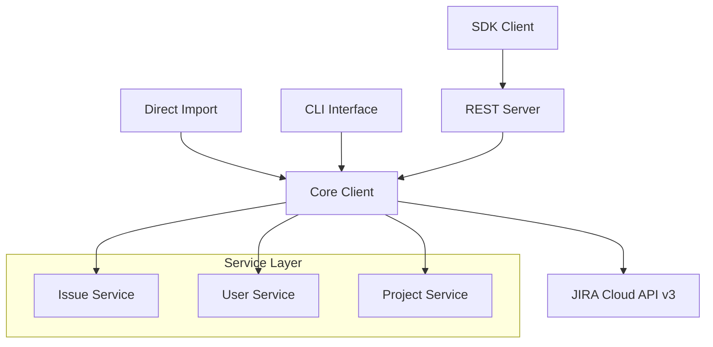

# JIRA API Python Package

A comprehensive, production-ready Python package for interacting with **Jira Cloud REST API v3**. Built with modern Python practices and enterprise-grade architecture.

## ✨ Features

- **🔌 Four Interfaces**: Direct Import, CLI, REST Server, and SDK Client
- **⚡ Modern Stack**: Built with FastAPI, Pydantic, HTTPX, and Typer
- **🔒 Type Safety**: Full mypy strict compliance
- **🧪 Well Tested**: Comprehensive test coverage with pytest
- **📖 Auto Documentation**: Generated API docs and user guides
- **🚀 Production Ready**: CI/CD pipeline, error handling, and security

## 🏗️ Architecture



## 🚀 Quick Start

### Installation

```bash
pip install jira-api
```

### Direct Usage

```python
from jira_api import JiraClient

# Initialize client
with JiraClient("https://company.atlassian.net", "email@company.com", "api_token") as client:
    # Create an issue
    issue = client.create_issue({
        "project_id": "10000",
        "summary": "Fix critical bug",
        "issue_type_id": "10001"
    })
    print(f"Created issue: {issue.key}")
```

### CLI Usage

```bash
# Configure credentials
jira-api configure

# Create an issue
jira-api issue create --project PROJ --summary "New task" --type 10001

# Get issue details  
jira-api issue get PROJ-123
```

### REST Server

```bash
# Start the server
jira-api server --host 0.0.0.0 --port 8000

# Access docs at http://localhost:8000/docs
```

### SDK Client

```python
from jira_api.sdk import JiraSDKClient

# Connect to your server
with JiraSDKClient("http://localhost:8000", api_key="your-key") as sdk:
    issue = sdk.get_issue("PROJ-123")
    print(f"Issue: {issue.fields.summary}")
```

## 📋 Supported Operations

### 👥 User Management
- Get user by account ID or email
- Search users by query
- Find assignable users for projects

### 🎫 Issue Management  
- Create, read, update issues
- Assign/unassign issues
- Manage issue transitions
- Add/remove labels
- Handle attachments and comments

### 📁 Project Management
- Get project details
- Manage project versions
- List issue types and priorities

## 🛡️ Security Features

- **API Token Authentication**: Secure token-based auth (no passwords)
- **HTTPS Only**: All communication over encrypted connections
- **Input Validation**: Strict Pydantic model validation
- **Credential Management**: Secure storage in user home directory
- **Optional Server Auth**: API key protection for REST endpoints

## 📊 Quality Standards

- **Type Safety**: 100% mypy strict compliance
- **Test Coverage**: 80%+ with pytest
- **Code Quality**: Ruff linting and Black formatting
- **CI/CD**: Automated testing across Python 3.9-3.11
- **Documentation**: Auto-generated API reference

## 🔗 Links

- **[GitHub Repository](https://github.com/carlosmarte/jira-api-module)**
- **[PyPI Package](https://pypi.org/project/jira-api/)**
- **[Documentation](https://carlosmarte.github.io/jira-api-module/)**
- **[Issue Tracker](https://github.com/carlosmarte/jira-api-module/issues)**

## 📄 License

This project is licensed under the **MIT License** - see the [LICENSE](https://github.com/carlosmarte/jira-api-module/blob/main/LICENSE) file for details.

---

Ready to get started? Check out our [Installation Guide](getting-started/installation.md) and [Quick Start Tutorial](getting-started/quickstart.md)!